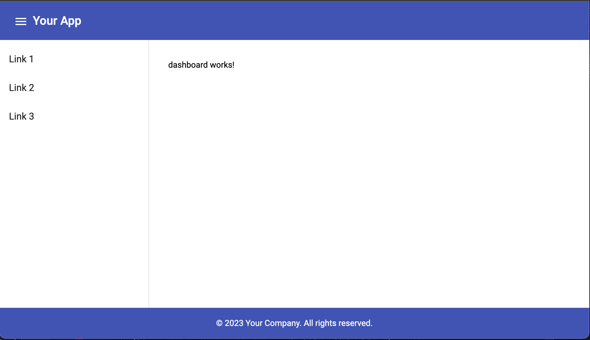

# Angular Material Basic Layout Template

A basic layout Angular template using Angular Material.

It included with the following
1. Header 
2. Sidebar with navigation menu
3. Content 
4. Footer

See below screenshot 

## How to run locally

1. Clone this repo
2. Go to clonedrepo/app folder
3. Run ng build
4. Run ng serve
   